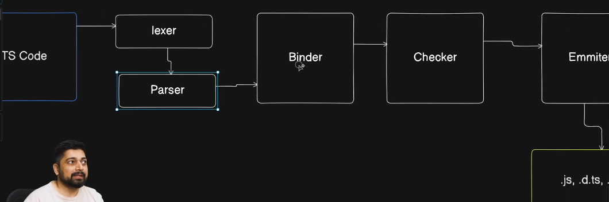

---------------Topics 1---------------------
>Why to Learn TypeScript 

1. It provides use Data types 
2. As javascript provides us freedom but there are many bugs due to this like :- you see in fn example of behavioring name but there comes some value 

3. Loose Docs -> JS Docs:
4. Developer Tooling -> Developer environment:
5. AI -> Better works on typescript:

>TypeScript is addon above javascript -> remember you typescript never runs 

-the typescript got converted into process and then run in js
> Typescript -> Process -> Javascript
> Basic.ts  →  TypeScript Compiler (tsc)  →  Basic.js  →  node runs it

- it provides use some good things :- 
1. Type Checker:
2. Consistency:

.ts file  →  compiled to  →  .js file  →  executed by Node
> Nowadays aap simply bun ya node mai directly ts ko run kr sakte ho , woh process ko abstract kr lete hain

> Notice: another file must also not have same function name 

---------------Topic 2----------------------
> At the end TS ko JS main hi Convert hona hai-----

> Flow :- TypeScript Code -> lexer -> Parser -> Binder -> Checker -> Emmiter/Generator -> .js,.d.ts,.map

1. Lexer work is doing tokenization , checking simple pbs like semicolon , paranthesis ,etc

2. Parser - see full code on Github Repo of TS
it makes AST -> which is a abstract Syntax tree 
and if any problem occurs then i can see that in AST Explorer and Parser Diagnostics tool 

3. Binder -> what it do is - make a. symbol tables b. make parent pointer c. flow nodes 

> now checker work is to gothrough two times with our code 

4. Checker - now checker ka work aapke code ki strict checking krna hai , isiliye ye aapke code se 2 times go through krta hai 
> for eg : Many IDEs pick this checker from github and show underlines of errors 